# C4 Component — TravelAgent (FastAPI App)

> Уровень: Component. Внутреннее устройство FastAPI App: слои, компоненты и их взаимодействие.

## Диаграмма

```mermaid
flowchart TB
  subgraph EXT["Внешние хранилища"]
    REDIS[("Redis")]
    PG[("PostgreSQL")]
  end

  subgraph API["API Gateway — src/api/"]
    EP["HTTP Endpoints<br/>/telegram/webhook · /chat/stream · /health"]
    AUTH["Auth + Rate Limit"]
    NORM["Нормализатор ChatMessage<br/>Telegram/Web → единый формат"]
  end

  subgraph CORE["Core"]
    ORCH["Orchestrator<br/>src/orchestrator.py"]
    ROUTER["Router<br/>src/router.py<br/>Intent Classifier LLM + few-shot"]
    DL["Decision Logic<br/>src/decision.py<br/>stage · action · available_tools"]
  end

  subgraph MEM["Memory Layer — src/memory/"]
    SM["Session Memory"]
    PM["Profile Memory"]
    SUMM["Conversation Summarizer"]
    PU["Profile Updater"]
    STT["Stage Tracker"]
  end

  subgraph LLM["LLM Layer — src/llm/"]
    CONN["LLM Connector<br/>src/llm/connector.py<br/>generate() · tools_call()"]
  end

  subgraph TOOLS["Tools Layer — src/tools/"]
    T_ST["search_tours"]
    T_GCP["get_client_profile"]
    T_UCP["update_client_profile"]
    T_CL["create_lead"]
    T_ULS["update_lead_stage"]
    T_GPI["get_policy_info"]
    T_LOG["log_interaction"]
  end

  CRM["CRM Adapter<br/>src/crm/adapter.py<br/>MVP: leads"]

  EP -->|"запрос"| AUTH
  AUTH -->|"пропуск / отказ"| NORM
  NORM -->|"ChatMessage"| ORCH

  ORCH -->|"контекст диалога"| ROUTER
  ROUTER -->|"классификация"| CONN
  CONN -->|"intent"| ROUTER
  ROUTER -->|"intent"| ORCH

  ORCH -->|"intent + состояние"| DL
  DL -->|"stage · action · available_tools"| ORCH

  ORCH <-->|"summary · stage · scratchpad"| SM
  SM <-->|"данные сессии"| REDIS

  ORCH <-->|"client_profile"| PM
  PM <-->|"профиль · сессии · лиды"| PG

  SUMM -->|"LLM-сжатие"| CONN
  SUMM -->|"summary"| SM
  SUMM -->|"архив/метаданные"| PG
  ORCH -.->|"триггер / после реплики"| SUMM

  PU -->|"извлечённые факты"| PG
  ORCH -.->|"события профиля"| PU

  STT <-->|"stage"| SM
  STT <-->|"stage · CRM sync"| PG
  STT -->|"синхронизация стадий"| CRM
  ORCH -.->|"обновление воронки"| STT

  ORCH -->|"контекст + available_tools + observations"| CONN
  CONN -->|"ответ LLM / tool_call requests"| ORCH
  ORCH -->|"вызов tool"| T_ST & T_GCP & T_UCP & T_CL & T_ULS & T_GPI
  T_ST & T_GCP & T_UCP & T_CL & T_ULS & T_GPI -->|"результаты tool"| ORCH

  T_GCP & T_UCP --> PM
  T_CL & T_ULS --> CRM
  CRM -->|"leads"| PG

  ORCH -->|"программный вызов<br/>не через LLM"| T_LOG
  T_LOG -->|"аудит"| PG
```

## Пояснения

| Компонент | Назначение |
|-----------|------------|
| **Endpoints + Auth + Rate Limit** | Точки входа FastAPI; идентификация/лимиты до бизнес-логики. |
| **Нормализатор ChatMessage** | Единый контракт сообщений независимо от Telegram или Web (SSE). |
| **Orchestrator** | Резолв client/session, координация Router → Decision Logic → память → LLM; вызов `log_interaction`. |
| **Router** | Классификация намерений (`small_talk`, `discovery`, `itinerary_search`, `policy_info`, `objection`, `pricing_budget`, `crm_event`) через LLM. |
| **Decision Logic** | Детерминированные правила: этап воронки, действие, список доступных tools для промпта/коннектора. |
| **Session / Profile Memory** | Redis для быстрого состояния сессии; PostgreSQL для долгоживущего профиля и связанных сущностей. |
| **Summarizer / Profile Updater / Stage Tracker** | Сжатие истории, извлечение фактов в профиль, учёт стадии с синхронизацией в CRM. |
| **LLM Connector** | Единая обёртка над провайдерами (Claude / OpenAI / Mistral). Возвращает Orchestrator-у ответ LLM или `tool_call` requests; сам tools не выполняет. |
| **Tools** | Исполняемые функции, вызываемые **Orchestrator-ом** по запросам LLM; **`log_interaction`** вызывается только кодом оркестратора (пишет аудит в PostgreSQL), не как tool модели. |
| **CRM Adapter** | MVP-слой над таблицей `leads` и связанными операциями из tools. |

**Примечание:** На диаграмме пунктиром показаны типичные триггеры/фоновые связи (суммаризация, профиль, стадии); точная последовательность зависит от реализации в `orchestrator` и обработчиках памяти.
