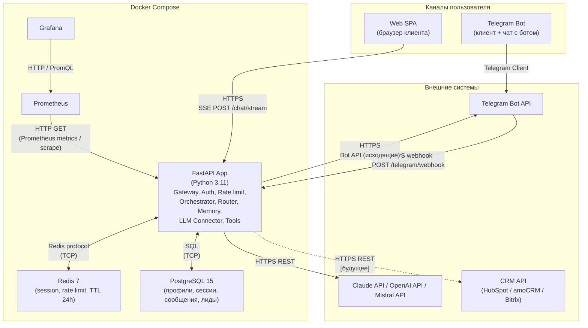

# C4 Container — TravelAgent

> Уровень: Container. Контейнеры Docker Compose, каналы и внешние интеграции.

## Диаграмма

## Пояснения

| Элемент | Роль |
|--------|------|
| **Telegram Bot (канал)** | Точка входа в Telegram: апдейты приходят в приложение через **webhook** на FastAPI; ответы уходят обратно через **Telegram Bot API** по HTTPS. |
| **Web SPA** | Клиентский UI в браузере; поток ответов агента — **SSE** к `POST /chat/stream` на FastAPI по HTTPS. |
| **FastAPI App** | Единый контейнер приложения: API-шлюз, аутентификация, rate limit, оркестрация диалога, маршрутизация и решения, слой памяти, коннектор к LLM и исполнение tools (см. `docs/system-design.md`). |
| **Redis 7** | Краткосрочная память сессии (summary, stage, scratchpad) и счётчики rate limit; данные с **TTL ~24h**. Протокол — **Redis** по TCP. |
| **PostgreSQL 15** | Долгосрочные данные: клиенты, сессии, сообщения, лиды. Доступ приложения — **SQL** по TCP. |
| **Prometheus** | Сбор метрик в модели pull: **HTTP**-запросы к эндпоинту метрик приложения (например `/metrics`). |
| **Grafana** | Дашборды и запросы к Prometheus по **HTTP** / **PromQL**. |
| **LLM APIs** | Внешние провайдеры; вызовы из приложения — **HTTPS REST**. |
| **CRM API** | Планируемая интеграция с внешней CRM; на диаграмме показана пунктиром. |

**Рендеринг:** используется стандартный синтаксис Mermaid `graph TB` (без плагина C4). Если превью в IDE некорректно, откройте файл в [Mermaid Live Editor](https://mermaid.live).
