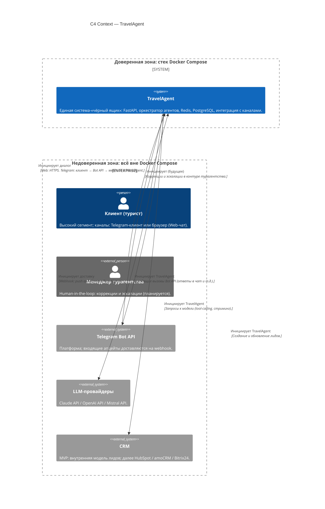

# C4 Context — TravelAgent

> Уровень: Context. Показывает TravelAgent как систему, её пользователей и внешние зависимости.

## Диаграмма

## Пояснения

| Элемент | Роль на уровне Context |
|--------|-------------------------|
| **TravelAgent** | Граница автоматизации турагентства: один логический контур доверия внутри Compose; детали сервисов и агентов — на уровнях Container / Component. |
| **Клиент (турист)** | Инициатор запроса в чат; для Web трафик идёт к backend TravelAgent, для Telegram — к инфраструктуре Telegram, а приложение получает события через webhook. |
| **Менеджер** | Внешний по отношению к автоматическому контуру человек; связи с TravelAgent появятся при внедрении HITL. |
| **Telegram Bot API** | Внешняя платформа: инициирует поток входящих через webhook; исходящие сообщения инициирует TravelAgent. |
| **LLM-провайдеры** | Внешние вычислительные API; каждый запрос к модели инициирует TravelAgent (ответ — обратно в систему). |
| **CRM** | Внешнее хранилище/контур лидов относительно «чёрного ящика»; запись лидов инициирует TravelAgent. |
| **Границы доверия** | Внутри **Docker Compose** — зона, где действуют политики деплоя, секретов и логирования проекта. Всё снаружи (пользователи, облачные API, будущие CRM) считается недоверенным: строгая валидация входа, TLS, ограничение доверия к данным извне. |

Диаграмма не детализирует внутренние компоненты (оркестратор, память, коннекторы к LLM) — они отражены в system-design на нижних уровнях C4.
