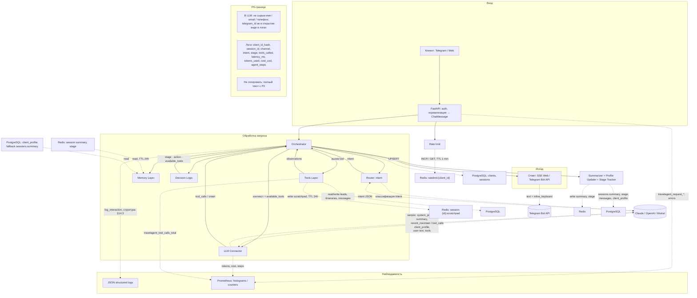

# Data Flow — TravelAgent

> Как данные проходят через систему: что читается/пишется в каждом хранилище, что логируется, что уходит во внешние API.

Источник: `docs/system-design.md` (§4–5, §10, §13–14).

## Диаграмма

## Пояснения по хранилищам

| Хранилище | Что пишется | Когда / контекст |
|-----------|-------------|------------------|
| **Redis** `session:{id}:summary` | JSON, сжатая история | Summarizer после хода; чтение в Memory Layer на каждом сообщении |
| **Redis** `session:{id}:stage` | Строка стадии воронки | Stage Tracker после хода; чтение в Memory Layer |
| **Redis** `session:{id}:scratchpad` | JSON, временные данные (промежуточные результаты `search_tours` и т.п.) | В цикле агента между шагами; TTL 24h |
| **Redis** `ratelimit:{client_id}` | Счётчик | На ingress; TTL 1 min |
| **PostgreSQL** `clients` | Профиль: `telegram_id`, имя, email, phone, segment, … | Резолв/создание клиента Orchestrator |
| **PostgreSQL** `client_profile` | `budget_range`, destinations, `travel_style`, `constraints` | Чтение в Memory; обновление Profile Updater |
| **PostgreSQL** `sessions` | `client_id`, channel, stage, summary | Создание/обновление сессии; fallback summary если Redis истёк |
| **PostgreSQL** `messages` | content, role, metadata (intent, stage, tokens, latency) | Персист сообщений пользователя/агента |
| **PostgreSQL** `leads` | status, budget, destination, travel_dates | Tool `create_lead` / смена стадии |
| **PostgreSQL** `itineraries` | Варианты туров для лида | Привязка к `lead_id` после подбора |
| **LLM API** | system prompt, **обезличенный/структурированный** профиль предпочтений, summary, недавние реплики, описания tools | Каждый вызов Router/основного агента; **без сырых PII** (имя, email, телефон не в контекст) |
| **Telegram Bot API** | Текст ответа, `inline_keyboard` | Исходящее сообщение в TG |
| **CRM API** (будущее) | Данные лидов | Синхронизация после квалификации |
| **Логи (JSON)** | `client_id_hash`, `session_id`, channel, intent, stage, `tools_called`, latency, tokens, cost, `agent_steps` | Структурированное логирование; **не** полный текст с PII |
| **Prometheus** | `travelagent_request_duration_seconds`, `travelagent_llm_tokens_total`, `travelagent_llm_cost_usd_total`, `travelagent_tool_calls_total`, `travelagent_agent_steps_total`, `travelagent_errors_total` (+ gauge/counter из §14.1 при необходимости) | Скрапинг метрик сервиса |

### Связка с метриками и логами

- В **логах** отражаются агрегаты и идентификаторы без чувствительного содержимого; **telegram_id** — только хэш (см. §13.2–13.3 SDD).
- **Prometheus** агрегирует latency, токены, стоимость, число вызовов tools и шагов агента, ошибки — без телеметрии по содержимому сообщений.
