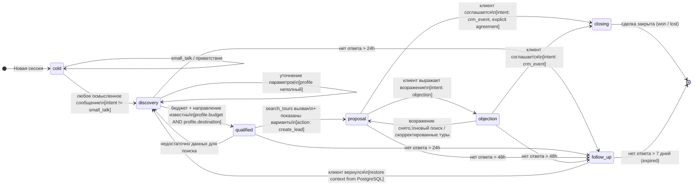

# State Machine: Воронка продаж TravelAgent

**Версия:** 1.0  
**Статус:** Актуальный  
**Источник истины:** [System Design §3, §5](../system-design.md)

---

## Обзор

Воронка продаж описывает жизненный цикл диалога с клиентом от первого обращения до закрытия сделки. Каждая сессия имеет ровно одну активную стадию (`stage`), хранящуюся в Redis (`session:{id}:stage`) и PostgreSQL (`sessions.current_stage`).

**Стадии:** `cold` → `discovery` → `qualified` → `proposal` ↔ `objection` → `closing` / `follow_up`

---

## Диаграмма переходов



---

## Таблица переходов

| Из → | В → | Гвард (условие) | Action / Side-effect |
|---|---|---|---|
| `[*]` | `cold` | Новая сессия создана | Создать `sessions` запись в PostgreSQL |
| `cold` | `discovery` | `intent != small_talk` | — |
| `cold` | `cold` | `intent == small_talk` | Приветственный ответ |
| `discovery` | `qualified` | `profile.budget` and `profile.destination` заполнены | `create_lead(status=new)` |
| `discovery` | `discovery` | Профиль неполный | Агент задаёт уточняющий вопрос |
| `discovery` | `follow_up` | Нет ответа > 24h | Запланировать follow-up сообщение |
| `qualified` | `proposal` | `search_tours` вернул ≥ 1 результат, варианты показаны | `update_lead_stage(proposal)` |
| `qualified` | `discovery` | `search_tours` вернул 0 результатов | Уточнить параметры |
| `qualified` | `follow_up` | Нет ответа > 24h | — |
| `proposal` | `objection` | `intent == objection` | `update_lead_stage(contacted)` |
| `proposal` | `closing` | Явное согласие клиента | `update_lead_stage(won)` |
| `proposal` | `follow_up` | Нет ответа > 48h | — |
| `objection` | `proposal` | Возражение снято, скорректированы параметры | `search_tours` (повторно), `update_lead_stage(proposal)` |
| `objection` | `closing` | Явное согласие после обработки | `update_lead_stage(won)` |
| `objection` | `follow_up` | Нет ответа > 48h | — |
| `closing` | `[*]` | Финал сделки | `update_lead_stage(won \| lost)`, сессия закрыта |
| `follow_up` | `discovery` | Клиент вернулся | Восстановить контекст из PostgreSQL |
| `follow_up` | `[*]` | Нет ответа > 7 дней | `sessions.status = expired` |

---

## Маппинг stage → leads.status

| Stage | leads.status | Действие |
|---|---|---|
| `cold` | — | Лид не создаётся |
| `discovery` | — | Лид не создаётся |
| `qualified` | `new` | `create_lead()` |
| `proposal` | `proposal` | `update_lead_stage("proposal")` |
| `objection` | `contacted` | `update_lead_stage("contacted")` |
| `closing` (won) | `won` | `update_lead_stage("won")` |
| `closing` (lost) | `lost` | `update_lead_stage("lost")` |
| `follow_up` | `contacted` | `update_lead_stage("contacted")` |

---

## Хранение стадии

```
Redis:      session:{id}:stage  →  строка, TTL 24h
PostgreSQL: sessions.current_stage  →  VARCHAR, персистентно
PostgreSQL: leads.status  →  синхронизируется при переходах qualified+
```

**Fallback:** если Redis-ключ отсутствует (TTL истёк или Redis недоступен), Stage Tracker читает `sessions.current_stage` из PostgreSQL и восстанавливает Redis-ключ.

---

## Тайм-ауты follow_up

| Stage | Тайм-аут до follow_up | Поведение |
|---|---|---|
| `discovery` | 24 часа | Мягкое напоминание («Вы хотели подобрать тур?») |
| `qualified` | 24 часа | Напоминание с результатами поиска |
| `proposal` | 48 часов | Напоминание с предложенными вариантами |
| `objection` | 48 часов | Повторное предложение / уточнение |
| `follow_up` | 7 дней | Сессия закрывается как `expired` |

---

## Связанные документы

- [System Design §3 — Стадии воронки](../system-design.md#3-список-модулей-и-их-роли)
- [System Design §5.4 — Stage Tracker](../system-design.md#54-stage-tracker)
- [spec-memory-context.md §6 — Stage Tracker](../specs/spec-memory-context.md)
- [spec-orchestrator.md](../specs/spec-orchestrator.md)
