# Workflow: выполнение запроса в TravelAgent

> Пошаговый граф обработки входящего сообщения от клиента до ответа, включая все ветки ошибок.

## Диаграмма

```mermaid
flowchart TD
    subgraph entry["Вход"]
        A[("Клиент: Telegram или Web-чат")] --> B["FastAPI: webhook или SSE / REST"]
    end

    B --> C{"Auth OK?"}
    C -->|Нет| C_AUTH["Отклонить запрос"]
    C -->|Да| D{"Rate limit OK?"}
    D -->|Нет| C_RL["429 Too Many Requests"]
    D -->|Да| E["Нормализатор → ChatMessage"]

    E --> F{"Prompt injection?"}
    F -->|Да| C_PI["Отклонить запрос"]
    F -->|Нет| G["Orchestrator: резолв / создание client и session"]

    G --> H{"PostgreSQL доступен?"}
    H -->|Нет| I["Аварийный режим без профиля"]
    H -->|Да| J["Client + session в PostgreSQL"]
    I --> K["Router: intent LLM + few-shot + JSON schema"]
    J --> K

    K --> L["Memory Layer: summary, client_profile, stage"]
    L --> M{"Redis доступен?"}
    M -->|Нет| N["Fallback: session memory из PostgreSQL"]
    M -->|Да| O["Summary + stage из Redis; профиль из PG при наличии"]
    N --> P["Decision Logic: target_stage, action, available_tools"]
    O --> P

    P --> R

    subgraph react_loop["Агентный цикл (ReAct — управляет Orchestrator)"]
        direction TB
        R["Вызов LLM: system_prompt + memory + message + available_tools"] --> S{"LLM API OK?"}
        S -->|Нет после retry| S_CB["Retry 3× exponential backoff → Circuit Breaker"]
        S_CB --> S_MSG["Текст: «Сервис временно недоступен»"]
        S -->|Да / успех после retry| T{"Есть tool_calls?"}
        T -->|Нет| U["Финальный ответ LLM"]
        T -->|Да| V["Orchestrator выполняет tools → observations"]
        V --> X{"Номер шага ReAct ≤ 5?"}
        X -->|Да| R
        X -->|Нет| Y["Принудительный финальный ответ с пояснением"]
    end

    U --> OV{"Output Validation"}
    Y --> OV
    OV -->|"Утечка system prompt /<br/>галлюцинации по турам"| FILTER["Фильтрация / коррекция ответа"]
    OV -->|OK| Z_DELIVER
    FILTER --> Z_DELIVER
    S_MSG --> Z_DELIVER

    Z_DELIVER{"Канал доставки?"}
    Z_DELIVER -->|Telegram| TG["Отправка ответа через Telegram Bot API"]
    Z_DELIVER -->|Web| SSE["Стриминг ответа клиенту SSE"]

    TG --> POST["Summarizer + Profile Updater + Stage Tracker → Redis + PostgreSQL"]
    SSE --> POST
    POST --> LOG["log_interaction: запись активности"]

    style C_AUTH fill:#f96,stroke:#333
    style C_RL fill:#f96,stroke:#333
    style C_PI fill:#f96,stroke:#333
    style S_MSG fill:#fc9,stroke:#333
    style FILTER fill:#fc9,stroke:#333
    style Y fill:#9cf,stroke:#333
    style I fill:#ccf,stroke:#333
    style N fill:#ccf,stroke:#333
```

### Уточнение по ReAct

Цикл **ReAct** управляется **Orchestrator-ом** (не LLM Connector-ом). При наличии `tool_calls` Orchestrator выполняет tools и передаёт observations обратно в LLM. Счётчик шагов увеличивается; при **шаге > 5** дальнейшие tool-calls не выполняются — формируется **принудительный финальный ответ** с пояснением (ADR-007). Узел **«LLM API OK?»** включает до **3 повторов** с exponential backoff; при исчерпании попыток срабатывает **Circuit Breaker** (open после 5 ошибок за 60с → cooldown 30с).

Пустой результат `search_tours` возвращается как observation в LLM — агент формирует ответ с учётом контекста (§6.4 No Hallucination). **Output Validation** после финального ответа проверяет утечку system prompt и галлюцинации по турам (цены/даты/отели без данных из tools).

## Ключевые ветки ошибок

| Условие | Исход |
|--------|--------|
| Rate limit превышен | **429 Too Many Requests** |
| Auth failed | Запрос **отклонён** |
| Prompt Injection detected | Запрос **отклонён** |
| LLM API недоступен | До **3 retry** с exponential backoff → **Circuit Breaker** → текст **«Сервис временно недоступен»** |
| Max agent steps (> 5) | **Принудительный финальный ответ** с пояснением (без дальнейших tool-calls) |
| Пустой `search_tours` | Observation → LLM; ответ: **«По вашим параметрам вариантов не найдено»** + Output Validation на галлюцинации |
| Output Validation failed | **Фильтрация / коррекция** ответа (утечка system prompt, галлюцинации) |
| Redis недоступен | **Fallback** сессионной памяти на **PostgreSQL** |
| PostgreSQL недоступен | **Аварийный режим** без профиля (ограниченный контекст) |

Различие **Telegram** и **Web** на диаграмме показано только в узле **«Канал доставки?»**: после Output Validation — либо **Telegram Bot API**, либо **SSE-стрим**.
